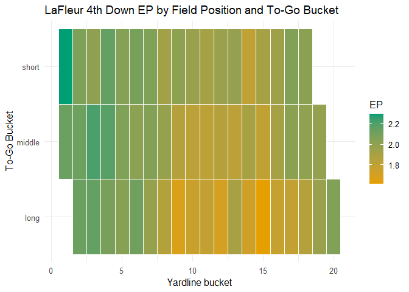
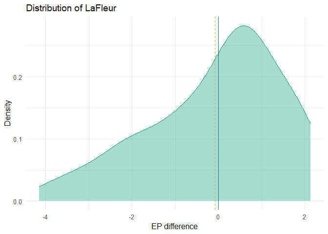

My README
================

# Executive Summary

In Week 1 of the 2024 NFL season, the Buffalo Bills faced a critical
fourth-and-two at the Arizona Cardinals’ 37-yard line, while leading
24-20. Rather than punting or attempting a long 53-yard field goal,
quarterback Josh Allen scrambled for five yards to convert the first
down. The drive continued, culminating in a 6-yard rushing touchdown by
Allen, and the Bills ultimately won the game 34-28. That fourth-down
conversion was important in the outcome of the game. Since 2017, NFL
teams have increased their fourth-down attempt rate by over 5%,
reflecting a broader shift toward analytics-driven decision-making
(Cespedes). While crucial to the outcome of drives and games, we can
consider varying game states and their impact on winning.

Using play-by-play data from the nflfastR package from 2010-2024, we
model drive outcomes, which include touchdowns, field goals, punts,
missed field goals, interceptions, fumbles, turnover on downs, or the
end of a half. This helps us analyze metrics like predicted points and
plays from a specific down, distance, and position on the field, which
can be applied to many game situations.

Like we saw above, fourth downs can be pivotal to the outcome of a game,
and analytics are likely used in determining whether to go for it or
not. We applied this model to game states on fourth down and used it to
simulate whether teams will punt, kick a field goal, or score a
touchdown, among other drive outcomes. We believe that our models
generalize NFL drives in a sufficient way, but they may not tell us much
about a specific team’s drive outcomes. So, we applied our general
simulation model to some of our group members’ favorite coaches, Matt
LaFleur. Using data from when LaFleur assumed play-calling duties in
Green Bay up to the end of last season, we adapted our model to his
play-calling tendencies and typical drives, analyzing drive outcomes and
expected points added.

Overall, our models are effective in showing drive outcomes from
starting and subsequent game states (considering down, yards to go, and
yards from the goal line), modeling fourth down decisions, and
simulating team specific drives and producing metrics. These analyses
can be valuable for understanding NFL game flow, fourth down decision
making, and simulating teams’ coaching and playing styles. However, our
model suffers from limited data in certain game states, like extreme
outliers in “yards to go” variables. Additionally, continually changing
rosters and coaching staff indicate that we can not accurately simulate
or predict future drives based on the team’s previous games or seasons,
which presumably had a different roster composition. This simulation
method is a pragmatic way of predicting team success, analyzing coaching
decisions, and modeling decision making in the NFL.

# Technical Report

### Overview

This project will explore the use of Markov Chain modeling to predict
fourth down outcomes in NFL games, with the goal of informing decisions
about whether a team should attempt to convert or not. Using play by
play data from the nflfastR package, we developed a probabilistic model
that estimates the likelihood of transitioning from one game state to
another. Our approach was inspired by Keith Goldner’s 2012 paper from
Northwestern University and was reinforced by concepts discussed in
Lectures 14 and 15 taught by Dr. Sameer Deshpande. This report outlines
the construction of our model, simulation, and demonstrates its
potential application.

### Data Gathering and Preparation

To build a reliable Markov Chain, we first ensured the quality and
relevance of our data set. We selected nflfastR to collect our data due
to its comprehensive coverage of NFL play by play data from 1999 to the
present. For this model, we focused on data from the 2010 to 2024
regular seasons to ensure the best balance between modern game play
trends and a good sufficient sample size. While including earlier
seasons could improve statistical analysis, we excluded them to avoid
outdated strategies and to save computing resources.

``` r
library(nflfastR)
library(tidyverse)

pbp = load_pbp(2010:2024)
```

To begin preparing our data, we first define what constitutes a “state”
in football. While there are many ways to approach this, we chose to
define a state using three components: down, distance to the first down
marker, and yard line. To maximize the use of our data, we bucketed the
yard line into groups of five yards and categorized the yards to go into
three ranges: short(0-3 yards), medium(4-7 yards), and long(8+ yards).
For the yard line variable, each bucket represents a five yard range,
where a value of 1 corresponds to being on the opponents 5 yard line or
closer, that is, within five yards of scoring. States are represented in
the format of down_ydstogo_yrdline; for example, 1_short_8 indicates a
first down with 0-3 yards to go, somewhere between the opponents 35 and
40 yard line.

``` r
bucket_breaks <- seq(0, 100, by = 5)  
bucket_labels <- seq_along(bucket_breaks[-1])  

#Splitting our ydstogo and yardline_100 variable into their buckets
pbp$ydstogo_bucket <- cut(pbp$ydstogo, breaks = bucket_breaks, labels = bucket_labels, right = TRUE, include.lowest = TRUE)

pbp <- pbp %>% 
  mutate( 
    ydstogo_type = case_when(
      ydstogo <= 3 ~ "short", 
      ydstogo > 3 & ydstogo <= 7 ~ "middle", 
      ydstogo > 7 ~ "long", 
      TRUE ~ NA_character_
    ))

pbp$yardline_100_bucket <- cut(pbp$yardline_100, breaks = bucket_breaks, labels = bucket_labels, right = TRUE, include.lowest = TRUE)
```

Next, we created dummy variables for absorbing plays, plays that result
in the end of a drive. These include touchdowns, field goal
attempts(made or missed), turnovers on downs, interceptions, fumbles
lost, safeties, punts, and the end of a half or a game. Since most of
these are already defined in nflfastR, we only need to manually define
game/half ends, turnovers on downs, and punts. In this code we also
generate a few additional variables that will be used later when
constructing our Markov Chain.

``` r
pbp = pbp %>%
  mutate(
    #Creates the end half variable by checking the descriptions of each play to see if Quarter 2 or 4 or game ended. 
    end_half = if_else(
    !is.na(desc) & grepl("\\b(END\\s+QUARTER\\s+(2|4)|END\\s+GAME)\\b", desc, ignore.case = TRUE),  
    1,
    0
  ),
  #Creates the turnover of downs variable by checking yards to go and yards gained on 4 downs. 
    turnover_downs = ifelse(!is.na(down) & down == 4 & !is.na(yards_gained) & !is.na(ydstogo) & yards_gained < ydstogo, 1, 0),
  #Creates our punt variable by checking if a punt was attempted while sorting out fake punt attempts.
  is_fake_punt = if_else(
      !is.na(punt_attempt) & punt_attempt == 1L &
      !is.na(play_type) & play_type %in% c("pass", "run"),
      TRUE, FALSE
    ),
    punt = case_when(
      !is.na(punt_attempt) & punt_attempt == 1L & !is.na(is_fake_punt) & !is_fake_punt ~ 1L,
      TRUE ~ 0L
    ),
  previous_play_type_raw = lag(play_type),           # raw previous play type (may be different possession)
    previous_posteam = lag(posteam),                   # which team had possession on previous play
    previous_play_type = if_else(
      !is.na(previous_play_type_raw) & previous_posteam == posteam,
      previous_play_type_raw,
      NA_character_)
  ) %>%
  select(-is_fake_punt)
```

We then clean the dataset by removing unnecessary variables and
excluding play types that are not relevant to our analysis, such as
extra points, penalties, and timeouts.

``` r
pbp_selected = pbp %>%
  select(play_id, game_id, down, ydstogo, ydstogo_bucket, ydstogo_type, yardline_100, yardline_100_bucket, score_differential, play_type, series_result, fumble_lost, interception, field_goal_result, touchdown, safety, end_half, turnover_downs, posteam, punt_attempt, punt, desc, previous_play_type, posteam, fixed_drive) %>%
  filter(
    play_type != "extra_point" | is.na(play_type),
    !(str_detect(desc, regex("TWO-POINT CONVERSION ATTEMPT", ignore_case = TRUE)))
  )
```

We then address absorbing states by creating a new variable called
absorbing_event, which is NA if no absorbing event occurs and otherwise
contains the name of the event. We also constructed our state variable
by combining the down, distance, and yard line components, carefully
handling any NA values to prevent invalid states. Additionally, we
create a next_state variable to represent the resulting state after each
play.

``` r
# 1.absorbing event function
get_absorb <- function(df) {
  case_when(
    !is.na(df$touchdown) & df$touchdown == 1 ~ "TD",
    !is.na(df$field_goal_result) & tolower(df$field_goal_result) == "made" ~ "FG",
    !is.na(df$field_goal_result) & tolower(df$field_goal_result) == "missed" ~ "MissedFG",
    !is.na(df$safety) & df$safety == 1 ~ "Safety",
    !is.na(df$interception) & df$interception == 1 ~ "INT",
    !is.na(df$fumble_lost) & df$fumble_lost == 1 ~ "Fumble",
    df$punt == 1 ~ "Punt",
    df$turnover_downs == 1 ~ "Downs",
    df$end_half == 1 ~ "End",
    TRUE ~ NA_character_
  )
}
```

``` r
# 2. create stable state strings when possible, get rid of scenarios where the state would include a NA value
state <- ifelse(!is.na(pbp_selected$down) &
                !is.na(pbp_selected$ydstogo_type) &
                !is.na(pbp_selected$yardline_100_bucket),
                paste(pbp_selected$down, pbp_selected$ydstogo_type, pbp_selected$yardline_100_bucket, sep = "_"),
                NA_character_)

absorbing_event <- get_absorb(pbp_selected) 


pbp_selected <- pbp_selected %>%
  mutate(state = state, absorbing_event = absorbing_event) %>%
  arrange(game_id, play_id) %>%
  group_by(game_id, fixed_drive) %>%
  mutate(next_state = lead(state)) %>%
  ungroup() %>%
  rename(start_state = state)
```

### Model Creation

We now began to construct our Markov Chain model.The first step was to
calculate transition counts, which is how often a play moves from one
state X to another state Y. We first counted transitions between
transient states (those that are not absorbing), followed by transitions
from transient states to absorbing states.

``` r
# Helper to create counts for one action
counts_for_action <- function(df, action_name = NULL) {
  # decide whether to apply the play_type filter
  df_act <- df %>%
    { if (!is.null(action_name) && !is.na(action_name) && nzchar(action_name)) filter(., play_type == action_name) else . }

  trans_trans <- df_act %>%
    filter(!is.na(start_state)) %>%
    filter(is.na(absorbing_event)) %>%                        # no absorbing outcome on this play
    filter(!is.na(next_state)) %>%
    count(start_state, next_state, name = "n")

  trans_abs <- df_act %>%
    filter(!is.na(start_state)) %>%
    filter(!is.na(absorbing_event)) %>%
    count(start_state, absorbing_event, name = "n")

  list(trans_trans = trans_trans, trans_abs = trans_abs)
}

# Define transient and absorbing states 
transient_states <- sort(unique(na.omit(pbp_selected$start_state)))
absorbing_states <- sort(unique(na.omit(pbp_selected$absorbing_event)))

#Create count dfs
general_counts = counts_for_action(pbp_selected)
```

Next, we converted these counts into transition probabilities, which for
the basis of our Markov Chan model. To estimate the expected points (EP)
value of each state, we applied the methods developed by Keith Goldner.

``` r
library(Matrix)

build_QR_EP2 <- function(tt, ta, alpha = 1){ 

  trans_trans <- tt
  trans_abs <- ta

  transient_states <- sort(unique(c(trans_trans$start_state, trans_abs$start_state)))
  absorbing_states <- sort(unique(trans_abs$absorbing_event))

  i <- match(trans_trans$start_state, transient_states)
  j <- match(trans_trans$next_state, transient_states)

  valid_idx <- which(!is.na(i) & !is.na(j))
  i <- i[valid_idx]
  j <- j[valid_idx]

  trans_trans <- trans_trans[valid_idx, , drop = FALSE]

  Qc <- sparseMatrix(i = i, j = j, x = trans_trans$n,
    dims = c(length(transient_states), length(transient_states)),
    dimnames = list(transient_states, transient_states))

  ia <- match(trans_abs$start_state, transient_states)
  ja <- match(trans_abs$absorbing_event, absorbing_states)

  Rc <- sparseMatrix(i = ia, j = ja, x = trans_abs$n,
    dims = c(length(transient_states), length(absorbing_states)),
    dimnames = list(transient_states, absorbing_states))

  rows <- rowSums(Qc) + rowSums(Rc)
  keep <- which(rows > 0)

  orig_row_names_Q <- rownames(Qc)[keep]
  orig_col_names_Q <- colnames(Qc)[keep]
  orig_col_names_R <- colnames(Rc)

  # If alpha == 0, behave like original (no smoothing)
  if (is.null(alpha) || alpha == 0) {
    denom <- rows[keep]
    Qp <- Diagonal(x = 1 / denom) %*% Qc[keep, keep, drop = FALSE]
    Rp <- Diagonal(x = 1 / denom) %*% Rc[keep, , drop = FALSE]
  } else {
    # Laplace smoothing: add alpha to every possible cell in Q and R by row
    nQcol <- ncol(Qc)
    nRcol <- ncol(Rc)
    # raw row sums for kept rows
    raw_row_sum <- rows[keep]
    denom <- raw_row_sum + alpha * (nQcol + nRcol)

    # create sparse matrices of alpha
    # for Q: alpha for every (kept_row, all Q cols kept)
    alpha_Q_full <- Matrix(alpha, nrow = length(keep), ncol = nQcol, sparse = TRUE)
    # for R: alpha for every (kept_row, all R cols)
    alpha_R_full <- Matrix(alpha, nrow = length(keep), ncol = nRcol, sparse = TRUE)

    # add alpha to counts and normalize by denom
    Q_counts_plus <- Qc[keep, , drop = FALSE] + alpha_Q_full
    R_counts_plus <- Rc[keep, , drop = FALSE] + alpha_R_full

    Qp <- Diagonal(x = 1 / denom) %*% Q_counts_plus[, keep, drop = FALSE]
    Rp <- Diagonal(x = 1 / denom) %*% R_counts_plus
  }

  rownames(Qp) <- orig_row_names_Q
  colnames(Qp) <- orig_col_names_Q
  rownames(Rp) <- orig_row_names_Q
  colnames(Rp) <- orig_col_names_R

  trans_states <- rownames(Qp)
  abs_states <- colnames(Rp)

  #Touchdowns are worth 6.96 due to accounting for extra point make probablity found on Statmuse
  if(!exists("absorb_values")) {
    absorb_values <<- c(TD = 6.96, FG = 3, MissedFG = 0, Safety = -2,
    INT = 0, Fumble = 0, Punt = 0, Downs = 0, End = 0)
  }

  A_vec <- sapply(abs_states, function(x) absorb_values[[x]] %||% 0)
  N <- solve(Diagonal(n = nrow(Qp)) - Qp)
  EP <- as.numeric(N %*% (Rp %*% A_vec))
  list(Q = Qp, R = Rp, states = trans_states, abs = abs_states, EP = EP)
}

general_prob = build_QR_EP2(general_counts$trans_trans, general_counts$trans_abs, alpha = 0)
```

## Applications

### 4th Down Simulation

Our group focused on fourth down decision making, specifically
evaluating how often these decisions “work out”. Rather than analyzing
only the fourth down conversion itself, we decided to simulate the
remainder of the drive to assess what happens after a successful
conversion. This approach allows us to move beyond binary outcomes and
evaluate whether a team continued successful or not on these
conversions.

We implemented three simulation strategies:

1.  A general analysis of fourth down attempts across different field
    positions.
2.  A breakdown based on distance to the first down marker.
3.  A combined method that evaluates outcomes by specific game state.

``` r
simulate_drive <- function(start_state, n_sim = 500, max_iterations = 30, model = general_prob) {
  final_outcome <- rep(NA, times = n_sim)
  sim_ep <- rep(NA, times = n_sim)

  for (r in 1:n_sim) {
    set.seed(222 + r)
    current_state <- start_state
    iteration_counter <- 1
    fg_blocked <- TRUE  # Block FG only for the first fourth down

    while (!(current_state %in% model$abs) & iteration_counter < max_iterations) {
      next_transient <- model$Q[current_state, , drop = TRUE]
      next_absorb <- model$R[current_state, , drop = TRUE]
      all_next <- c(next_transient, next_absorb)

      # Remove FG only on the first fourth down
      if (fg_blocked && "FG" %in% names(all_next)) {
        all_next <- all_next[names(all_next) != "FG"]
        fg_blocked <- FALSE  # Allow FG in future iterations
      }

      total_prob <- sum(all_next)
      if (total_prob == 0) break

      probs <- as.numeric(all_next) / total_prob
      next_states <- names(all_next)

      current_state <- sample(next_states, size = 1, prob = probs)
      iteration_counter <- iteration_counter + 1
    }

    final_outcome[r] <- current_state
    sim_ep[r] <- model$EP[start_state]
  }

  tibble(state = start_state,
         TD = sum(final_outcome == "TD"),
         FG = sum(final_outcome == "FG"),
         Downs = sum(final_outcome == "Downs"),
         Punt = sum(final_outcome == "Punt"),
         EP_mean = mean(sim_ep, na.rm = TRUE))
}
```

``` r
state_df <- tibble(state = general_prob$states) %>%
  separate(state, into = c("down", "ydstogo_type", "yardline_bucket"), sep = "_", convert = TRUE, remove = FALSE)

fourth_down_df <- state_df %>% filter(down == 4)

fourth_short  <- fourth_down_df %>% filter(ydstogo_type == "short") %>% pull(state)
fourth_middle <- fourth_down_df %>% filter(ydstogo_type == "middle") %>% pull(state)
fourth_long   <- fourth_down_df %>% filter(ydstogo_type == "long") %>% pull(state)
```

``` r
results_list <- list()

for (cat in c("short", "middle", "long")) {
  states <- get(paste0("fourth_", tolower(cat)))
  results <- map_dfr(states, simulate_drive)
  results$category <- cat
  results$distance <- sub(".*_", "", states)
  results_list[[cat]] <- results
}

combined_results <- bind_rows(results_list)
```

``` r
combined_results %>%
  group_by(distance) %>%
  summarise(
            TD_rate = mean(TD / 500),
            Downs_rate = mean(Downs / 500),
            Punt_rate = mean(Punt / 500),
            FG_rate = mean(FG/500)) %>%
  ungroup() %>%
  arrange(as.integer(distance))
```

    ## # A tibble: 20 × 5
    ##    distance TD_rate Downs_rate Punt_rate FG_rate
    ##    <chr>      <dbl>      <dbl>     <dbl>   <dbl>
    ##  1 1         0.362      0.584   0        0.005  
    ##  2 2         0.244      0.606   0        0.014  
    ##  3 3         0.223      0.547   0        0.04   
    ##  4 4         0.162      0.471   0        0.0447 
    ##  5 5         0.151      0.399   0.000667 0.0473 
    ##  6 6         0.131      0.359   0.01     0.06   
    ##  7 7         0.117      0.385   0.074    0.058  
    ##  8 8         0.105      0.321   0.399    0.048  
    ##  9 9         0.0773     0.208   0.634    0.034  
    ## 10 10        0.046      0.176   0.719    0.0273 
    ## 11 11        0.0387     0.134   0.788    0.0193 
    ## 12 12        0.0287     0.108   0.835    0.008  
    ## 13 13        0.0267     0.0927  0.845    0.00467
    ## 14 14        0.0247     0.09    0.852    0.0107 
    ## 15 15        0.014      0.0607  0.893    0.00533
    ## 16 16        0.018      0.0647  0.895    0.00333
    ## 17 17        0.014      0.0587  0.901    0.00467
    ## 18 18        0.01       0.054   0.908    0.002  
    ## 19 19        0.0133     0.0667  0.893    0      
    ## 20 20        0.062      0.037   0.84     0

The first results table, sorted by distance to the end zone in five yard
buckets, aligns with our expectations. Touchdown rates increase as teams
get closer to the end zone, while punt rates rise the farther they are
from the end zone. Turnover on downs rates also increase near the end
zone, which makes sense given the simulation set up. The “distance to
end zone” variable reflects the starting point of the simulation, for
example, a value of 1 indicates a fourth down play beginning within five
yards of the end zone. It is important to note that all rate variables
reflect the outcome of the entire drive, not just the fourth down play.
Simulations starting close to the end zone often result in a touchdown
or turnover, leading to higher turnover on downs rates in these
scenarios.

``` r
combined_results %>%
  group_by(category) %>%
  summarise(
            TD_rate = mean(TD / 500),
            Downs_rate = mean(Downs / 500),
            Punt_rate = mean(Punt / 500),
            FG_rate = mean(FG/500))
```

    ## # A tibble: 3 × 5
    ##   category TD_rate Downs_rate Punt_rate FG_rate
    ##   <chr>      <dbl>      <dbl>     <dbl>   <dbl>
    ## 1 long      0.0351      0.216     0.599 0.00484
    ## 2 middle    0.0793      0.238     0.540 0.0129 
    ## 3 short     0.154       0.262     0.445 0.0502

The second table shows how outcomes vary with proximity to the first
down marker. As teams get closer to converting, we observe a increase in
rates for touchdowns, turnovers on downs, and field goal attempts, as
well as a decrease in punts. This result is somewhat surprising, as we
might expect turnover on downs to be higher in longer distance
situations. One possible explanation is limited data availability. Until
recently, fourth down attempts, especially in long or medium yardage,
were
[uncommon](https://medium.com/@dacr444/analyzing-4th-down-attempts-over-the-last-24-seasons-8c0f99c538cb)
(Cespedes). This lack of data may lead to an inaccurate estimates of
conversion rates in those scenarios.

``` r
combined_results %>%
  group_by(state) %>%
  summarise(
            TD_rate = mean(TD / 500),
            Downs_rate = mean(Downs / 500),
            Punt_rate = mean(Punt / 500),
            FG_rate = mean(FG/500)) %>%
  ungroup() %>%
  arrange(desc(TD_rate))
```

    ## # A tibble: 58 × 5
    ##    state      TD_rate Downs_rate Punt_rate FG_rate
    ##    <chr>        <dbl>      <dbl>     <dbl>   <dbl>
    ##  1 4_short_1    0.478      0.476     0       0.01 
    ##  2 4_short_2    0.38       0.508     0       0.04 
    ##  3 4_short_3    0.346      0.462     0       0.102
    ##  4 4_short_4    0.28       0.416     0       0.108
    ##  5 4_short_5    0.26       0.412     0.002   0.094
    ##  6 4_middle_1   0.246      0.692     0       0    
    ##  7 4_short_6    0.244      0.35      0.004   0.136
    ##  8 4_middle_2   0.234      0.66      0       0.002
    ##  9 4_middle_3   0.208      0.528     0       0.016
    ## 10 4_short_8    0.206      0.406     0.176   0.086
    ## # ℹ 48 more rows

This final table is a combination of the previous two, and because of
that we see similar trends.

### Matt LaFleur

We were interested in analyzing one specific coach and comparing his
results to league wide averages. We chose Matt LaFleur, partly because
several members of our group are Packers fans, and partly because he has
coached enough games to provide a meaningful sample size. To do this, we
built a LaFleur specific Markov model using the same methodology as our
general NFL model.

``` r
pbp_GB = load_pbp(2019:2024)

bucket_breaks <- seq(0, 100, by = 5)  
bucket_labels <- seq_along(bucket_breaks[-1])  

#Splitting our ydstogo and yardline_100 variable into their buckets
pbp_GB$ydstogo_bucket <- cut(pbp_GB$ydstogo, breaks = bucket_breaks, labels = bucket_labels, right = TRUE, include.lowest = TRUE)

pbp_GB <- pbp_GB %>% 
  mutate( 
    ydstogo_type = case_when(
      ydstogo <= 3 ~ "short", 
      ydstogo > 3 & ydstogo <= 7 ~ "middle", 
      ydstogo > 7 ~ "long", 
      TRUE ~ NA_character_
    ))


pbp_GB$yardline_100_bucket <- cut(pbp_GB$yardline_100, breaks = bucket_breaks, labels = bucket_labels, right = TRUE, include.lowest = TRUE)

pbp_GB = pbp_GB %>%
  mutate(
    #Creates the end half variable by checking the descriptions of each play to see if Quarter 2 or 4 or game ended. 
    end_half = if_else(
    !is.na(desc) & grepl("\\b(END\\s+QUARTER\\s+(2|4)|END\\s+GAME)\\b", desc, ignore.case = TRUE),  
    1,
    0
  ),
  #Creates the turnover of downs variable by checking yards to go and yards gained on 4 downs. 
    turnover_downs = ifelse(!is.na(down) & down == 4 & !is.na(yards_gained) & !is.na(ydstogo) & yards_gained < ydstogo, 1, 0),
  #Creates our punt variable by checking if a punt was attempted while sorting out fake punt attempts.
  is_fake_punt = if_else(
      !is.na(punt_attempt) & punt_attempt == 1L &
      !is.na(play_type) & play_type %in% c("pass", "run"),
      TRUE, FALSE
    ),
    punt = case_when(
      !is.na(punt_attempt) & punt_attempt == 1L & !is.na(is_fake_punt) & !is_fake_punt ~ 1L,
      TRUE ~ 0L
    ),
  previous_play_type_raw = lag(play_type),           # raw previous play type (may be different possession)
    previous_posteam = lag(posteam),                   # which team had possession on previous play
    previous_play_type = if_else(
      !is.na(previous_play_type_raw) & previous_posteam == posteam,
      previous_play_type_raw,
      NA_character_)
  ) %>%
  select(-is_fake_punt)


pbp_selected_GB = pbp_GB %>%
  filter(posteam == "GB") %>%
  select(play_id, game_id, down, ydstogo, ydstogo_bucket, ydstogo_type, yardline_100, yardline_100_bucket, score_differential, play_type, series_result, fumble_lost, interception, field_goal_result, touchdown, safety, end_half, turnover_downs, posteam, punt_attempt, punt, desc, previous_play_type, posteam, fixed_drive) %>%
  filter(
    play_type != "extra_point" | is.na(play_type),
    !(str_detect(desc, regex("TWO-POINT CONVERSION ATTEMPT", ignore_case = TRUE)))
  )


state_GB <- ifelse(!is.na(pbp_selected_GB$down) &
                !is.na(pbp_selected_GB$ydstogo_type) &
                !is.na(pbp_selected_GB$yardline_100_bucket),
                paste(pbp_selected_GB$down, pbp_selected_GB$ydstogo_type, pbp_selected_GB$yardline_100_bucket, sep = "_"),
                NA_character_)

absorbing_event <- get_absorb(pbp_selected_GB) 


pbp_selected_GB <- pbp_selected_GB %>%
  mutate(state = state_GB, absorbing_event = absorbing_event) %>%
  arrange(game_id, play_id) %>%
  group_by(game_id, fixed_drive) %>%
  mutate(next_state = lead(state)) %>%
  ungroup() %>%
  rename(start_state = state)


# Define transient and absorbing states 
transient_states_GB <- sort(unique(na.omit(pbp_selected_GB$start_state)))
absorbing_states_GB <- sort(unique(na.omit(pbp_selected_GB$absorbing_event)))

#Create count dfs
general_counts_GB = counts_for_action(pbp_selected_GB)

general_prob_GB = build_QR_EP2(general_counts_GB$trans_trans, general_counts_GB$trans_abs, alpha = .5)
```

Once the LaFleur model was constructed, we compared his results to the
rest of the league in several ways. The first comparison focused on
expected points (EP) for each game state, evaluating how the LaFleur led
Packers performed relative to league averages in identical situations.

``` r
gb_key <- pbp_selected_GB %>%
  select(
    down,
    ydstogo,
    yardline_100,
    ydstogo_type,
    state_type = start_state
  )


lg_key <- tibble(state = general_prob$states) %>%
  transmute(state_type = state)

common_type <- intersect(gb_key$state_type, lg_key$state_type)
ix_gb <- match(common_type, gb_key$state_type)
ix_lg <- match(common_type, lg_key$state_type)

EP_compare <- tibble(
  state = common_type,
  EP_gb = general_prob_GB$EP[ix_gb],
  EP_league = general_prob$EP[ix_lg],
  EP_diff = EP_gb - EP_league
) %>% arrange(desc(abs(EP_diff)))

head(EP_compare, 15)
```

    ## # A tibble: 15 × 4
    ##    state       EP_gb EP_league EP_diff
    ##    <chr>       <dbl>     <dbl>   <dbl>
    ##  1 1_short_1    2.11    6.25     -4.14
    ##  2 1_middle_1   2.08    5.85     -3.77
    ##  3 1_middle_2   2.02    5.58     -3.56
    ##  4 2_short_2    2.06    5.52     -3.46
    ##  5 1_long_2     2.16    5.23     -3.07
    ##  6 2_middle_2   2.12    5.07     -2.94
    ##  7 1_long_3     2.17    4.97     -2.80
    ##  8 1_long_4     2.09    4.71     -2.62
    ##  9 2_short_4    2.17    4.74     -2.57
    ## 10 2_long_3     2.07    4.40     -2.34
    ## 11 2_middle_5   1.98    4.29     -2.31
    ## 12 4_long_12    2.24    0.107     2.13
    ## 13 4_long_14    2.18    0.0977    2.09
    ## 14 2_long_4     2.04    4.12     -2.09
    ## 15 4_middle_11  2.26    0.183     2.08

While these results look odd, we believe this is due to limitations in
the amount of data there is on Matt LaFleur’s coaching. LaFleur has
coached for only six and a half seasons, and since he has coached a
single team, the data set is significantly smaller than the league wide
sample.

Connecting back to our fourth down simulation results, we wanted to look
at the simulation results if we were to use the LaFleur model.

``` r
state_df <- tibble(state = general_prob_GB$states) %>%
  separate(state, into = c("down", "ydstogo_type", "yardline_bucket"), sep = "_", convert = TRUE, remove = FALSE)

fourth_down_df <- state_df %>% filter(down == 4)

fourth_short  <- fourth_down_df %>% filter(ydstogo_type == "short") %>% pull(state)
fourth_middle <- fourth_down_df %>% filter(ydstogo_type == "middle") %>% pull(state)
fourth_long   <- fourth_down_df %>% filter(ydstogo_type == "long") %>% pull(state)
```

``` r
results_list <- list()

for (cat in c("short", "middle", "long")) {
  states <- get(paste0("fourth_", tolower(cat)))
  results <- map_dfr(states, simulate_drive, model = general_prob_GB)
  results$category <- cat
  results$distance <- sub(".*_", "", states)
  results_list[[cat]] <- results
}

combined_results <- bind_rows(results_list)
```

``` r
combined_results %>%
  group_by(state) %>%
  summarise(
            TD_rate = mean(TD / 500),
            Downs_rate = mean(Downs / 500),
            Punt_rate = mean(Punt / 500),
            FG_rate = mean(FG/500)) %>%
  ungroup() %>%
  arrange(desc(TD_rate))
```

    ## # A tibble: 56 × 5
    ##    state       TD_rate Downs_rate Punt_rate FG_rate
    ##    <chr>         <dbl>      <dbl>     <dbl>   <dbl>
    ##  1 4_short_1     0.262      0.14      0.17    0.078
    ##  2 4_short_13    0.23       0.1       0.206   0.106
    ##  3 4_middle_19   0.228      0.082     0.22    0.108
    ##  4 4_middle_3    0.226      0.088     0.206   0.126
    ##  5 4_middle_4    0.226      0.088     0.206   0.126
    ##  6 4_long_3      0.218      0.09      0.206   0.126
    ##  7 4_short_4     0.216      0.102     0.228   0.096
    ##  8 4_short_7     0.216      0.112     0.206   0.102
    ##  9 4_long_6      0.212      0.104     0.2     0.106
    ## 10 4_middle_6    0.212      0.12      0.182   0.112
    ## # ℹ 46 more rows

Building on our earlier fourth down simulations, we re ran the analysis
using the LaFluer model. For simplicity, we focused on the combined
approach, which evaluates fourth down decisions based on both distance
to the first down marker and distance to the end zone. As with previous
LaFleur specific results, we observe some irregularities likely caused
by limited data. However, the overall trends were consistent with league
wide patterns, suggesting that LaFluers fourth down decisions is
comparable with other NFL coaches.

We also examined LaFleurs expected points across various fourth down
scenarios. This analysis can be seen in this table.

``` r
state_df_gb <- tibble(state = general_prob_GB$states) %>%
  tidyr::separate(state, into = c("down", "ydstogo_bucket", "yardline_bucket"),
                  sep = "_", convert = TRUE, remove = FALSE)
  
  

fourth_states_gb <- state_df_gb %>% dplyr::filter(down == 4)
m_gb <- match(fourth_states_gb$state, general_prob_GB$states)


fourth_states_gb <- fourth_states_gb %>%
  mutate(EP_gb = general_prob_GB$EP[m_gb])

dplyr::slice_max(fourth_states_gb, order_by = EP_gb, n = 20)
```

    ## # A tibble: 20 × 5
    ##    state       down ydstogo_bucket yardline_bucket EP_gb
    ##    <chr>      <int> <chr>                    <int> <dbl>
    ##  1 4_short_1      4 short                        1  2.29
    ##  2 4_middle_3     4 middle                       3  2.21
    ##  3 4_middle_4     4 middle                       4  2.18
    ##  4 4_short_4      4 short                        4  2.15
    ##  5 4_long_3       4 long                         3  2.15
    ##  6 4_middle_1     4 middle                       1  2.12
    ##  7 4_long_2       4 long                         2  2.12
    ##  8 4_middle_2     4 middle                       2  2.12
    ##  9 4_long_6       4 long                         6  2.11
    ## 10 4_short_6      4 short                        6  2.09
    ## 11 4_long_4       4 long                         4  2.09
    ## 12 4_short_2      4 short                        2  2.07
    ## 13 4_middle_5     4 middle                       5  2.06
    ## 14 4_short_7      4 short                        7  2.06
    ## 15 4_long_20      4 long                        20  2.05
    ## 16 4_short_17     4 short                       17  2.05
    ## 17 4_middle_7     4 middle                       7  2.05
    ## 18 4_short_5      4 short                        5  2.04
    ## 19 4_long_5       4 long                         5  2.03
    ## 20 4_short_18     4 short                       18  2.02

## Packer Visualizations

This heat-map concentrates just on 4th down plays. The x-axis is field
position split into 20-yard buckets and the y-axis is the distance to a
first down (short, middle, long). On the right we have a color scale
that indicates expected points. The green represents a higher EP, and
the yellow represents a lower EP. From this we can tell that LaFleur’s
play-calling is most efficient on short 4th-and-shorts, especially when
he gets into better field position. But efficiency drops in long-yardage
or mid-field situations.

``` r
oi <- palette.colors(8, palette = "Okabe-Ito")


state_df_gb <- tibble(state = general_prob_GB$states) %>%
  separate(state, into = c("down", "ydstogo_bucket", "yardline_bucket"),
           sep = "_", convert = TRUE, remove = FALSE) %>%
  mutate(EP_gb = general_prob_GB$EP[match(state, general_prob_GB$states)])


grid4 <- state_df_gb %>%
  filter(down == 4L) %>%
  mutate(
    ydstogo_bucket = factor(ydstogo_bucket, levels = c("short", "middle", "long"))
  )

ggplot(grid4, aes(x = yardline_bucket, y= ydstogo_bucket, fill = EP_gb)) +
  geom_tile(color = "white", linewidth = 0.3) +
  scale_y_discrete(limits = c("long", "middle", "short")) +
  scale_fill_gradient(
    name = "EP",
    low = oi[2],
    high = oi[4]
  ) +
  labs(
    title = "LaFleur 4th Down EP by Field Position and To-Go Bucket",
    x = "Yardline bucket",
    y = "To-Go Bucket"
  ) +
  theme_minimal(base_size = 12)
```

<!-- -->

The last visual highlights the density of EP differences from our
earlier table. Where the x-axis emphasizes where green bay is better or
worse compared to the league and the y-axis is how common that value is.
The solid line at 0 marks the league average and the dashed line is
LaFleur’s mean difference. The main thing to notice on this graph is
that the majority of the area under the curve is slightly to the right
of zero— meaning LaFleur is overall very close to the league average or
narrowly above with some variability by state. Overall, LaFleur performs
about average or slightly better than average depending on
situation/state.

``` r
oi <- palette.colors(8, palette = "Okabe-Ito")


epd <- EP_compare |> filter(is.finite(EP_diff))

ggplot(epd, aes(x = EP_diff)) +
  geom_density(fill = oi[4], color = oi[4], alpha = 0.35, linewidth = 0.7) +
  geom_vline(xintercept = 0, color = oi[6], linewidth = 0.7) +
  geom_vline(xintercept = mean(epd$EP_diff), linetype = "dashed", color = oi[2], linewidth = 0.7) +
  labs(
    title = "Distribution of LaFleur", 
    x = "EP difference",
    y = "Density"
  ) + 
  theme_minimal(base_size = 12)
```

<!-- -->

## Conclusions and Limitations

Overall, our project was a success. We built a Markov Chain that
estimates the probability of transitioning from one football state to
another, and applied it to both fourth down simulations and coach
specific comparisons. These applications allowed us to evaluate
offensive decision making in a structured, data driven way.

The primary limitation of our project was sample size. Accurately
estimating probabilities, especially for rare states, requires more
data. This issue was seen mainly in the LaFleur model, though even the
general model can benefit from additional seasons. Fortunately, our use
of 15 years of NFL data provided a strong foundation.

Our next steps include increasing our sample size, and looking at the
differences in transition probabilities given whether a play is a run or
a pass.

### References

Cespedes, Daniel. “Analyzing 4th down Attempts in the NFL over the Last
24 Seasons.” Medium, Medium, 10 Oct. 2023,
<medium.com/@dacr444>/analyzing-4th-down-attempts-over-the-last-24-seasons-8c0f99c538cb.

Deshpande, Sameer. “Lectures 14 & 15: Markov Chains.” 2025.

Goldner, Keith. “A Markov Model of Football: Using Stochastic Processes
to Model a Football Drive.” Journal of Quantitative Analysis in Sports,
2012.

“League Wide Extra Point Percentage in the NFL Year by Year 2010 to
2022.” StatMuse,
www.statmuse.com/nfl/ask/league-wide-extra-point-percentage-in-the-nfl-year-by-year-2010-to-2022.
Accessed 4 Nov. 2025.
